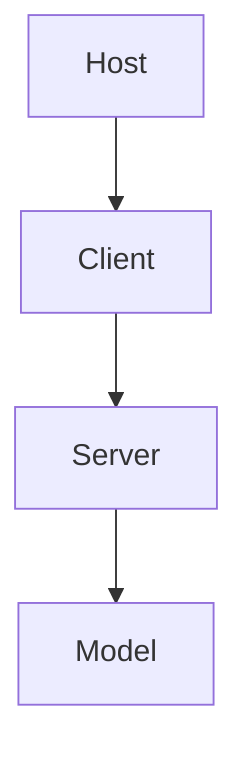

# MCP Proof-of-Concept with TypeScript and Node.js

This repository is a proof-of-concept implementation of the Model Context Protocol (MCP) using TypeScript and Node.js. It is designed to be a learning tool and a starting point for building more complex MCP-enabled applications.

## What is MCP?

The **Model Context Protocol (MCP)** is a specification that defines a standard way for a "host" application to provide contextual information to a "model" (like an AI or a plugin). This allows models to be more aware of the user's current context within the application, leading to more relevant and powerful interactions.

Think of it like this: instead of a generic chatbot, a model integrated via MCP can see what document you are editing, what data you have selected, or what part of an application you are currently using.

The core components in an MCP architecture are:

  * **Host**: The main application that the user is interacting with (e.g., a web editor, a design tool, a dashboard). The host is responsible for providing the context.
  * **Client**: A component that runs within the host environment. Its job is to gather the context from the host and send it to the server.
  * **Server**: A backend service that receives context from the client. It processes this context and can then pass it on to a model or another service. The server acts as a bridge.

This project will implement all three components to demonstrate a complete MCP workflow.

## Project Goal

The primary goal of this repository is to provide a clear and simple example of how to implement MCP using the official [`@modelcontextprotocol/sdk`](https://github.com/modelcontextprotocol/typescript-sdk).

By the end of this project, you will have:

  * A simple **Host** application (a basic web page).
  * An MCP **Client** that collects context from the web page.
  * An MCP **Server** built with Node.js that receives and logs the context.
  * A clear understanding of how these components interact.

## Technology Stack

  * **Backend**: [Node.js](https://nodejs.org/) with [Express](https://expressjs.com/) for the MCP Server.
  * **Frontend**: Plain HTML, CSS, and TypeScript for the Host and Client.
  * **MCP Implementation**: [`@modelcontextprotocol/sdk`](https://github.com/modelcontextprotocol/typescript-sdk).
  * **Build Tool**: `tsc` (the TypeScript compiler) and `ts-node-dev` for easy development.

-----

## Architecture

-----

## Project Roadmap

Here is a step-by-step plan to build our MCP proof-of-concept. Each step will be a separate task.

### Phase 1: Project Setup

  * [x] **Task 1: Initialize Project Structure**

      * Create a monorepo structure with separate packages for `client`, `server`, and `host`.
      * Initialize a `package.json` in the root and in each package.
      * Set up TypeScript configuration (`tsconfig.json`) for both client and server.

  * [x] **Task 2: Install Dependencies**

      * Install `express` and `@modelcontextprotocol/sdk` in the `server` package.
      * Install `@modelcontextprotocol/sdk` in the `client` package.
      * Install development dependencies like `typescript`, `ts-node-dev`, and `@types/express` at the root level.

### Phase 2: Server Implementation

  * [x] **Task 3: Create a Basic Express Server**

      * In the `server` package, create an `index.ts`.
      * Set up a simple Express server that listens on a specific port (e.g., 3000).
      * Add a basic health-check endpoint (e.g., `/`).

  * [x] **Task 4: Implement the MCP Server Logic**

      * Import `McpServer` from the SDK.
      * Instantiate `McpServer` and attach it to the Express app.
      * Implement a simple `onContext` handler that logs the received context to the console. This is the core of the server's functionality.

### Phase 3: Host and Client Implementation

  * [x] **Task 5: Create the Host Application**

      * In the `host` package, create an `index.html` file.
      * Add some simple interactive elements, like a text area (`<textarea>`) and a button. The content of this text area will be our "context".

  * [x] **Task 6: Create the MCP Client**

      * In the `client` package, create a `main.ts` file.
      * This script will be loaded by `index.html`.
      * Import `McpClient` from the SDK.

  * [x] **Task 7: Implement Client Logic**

      * Instantiate `McpClient`, pointing it to our server's address (e.g., `http://localhost:3000`).
      * Add an event listener to the button in the `host` application.
      * When the button is clicked, get the content from the text area.
      * Use the `client.setContext()` method to send this content to the server. The context should be structured according to the MCP specification (e.g., as a `Document` or a simple `string`).

### Phase 4: Integration and Testing

  * [x] **Task 8: Connect Host and Client**

      * Modify `index.html` to include the compiled client script (`main.js`).
      * Use a simple HTTP server (like `live-server`) or a bundler to serve the `host` and `client` files.

  * [x] **Task 9: End-to-End Test**

      * Run the server: `npm run dev --workspace=server`.
      * Serve the host application.
      * Open the host in a browser, type something in the text area, and click the button.
      * Verify that the context is logged by the server console.

  * [x] **Task 10: Documentation and Cleanup**

      * Add comments to the code explaining the key parts.
      * Update this README with instructions on how to run the project.
      * Ensure the code is clean and easy to understand.

## Running the Project

1. Install dependencies with `npm install`.
2. Build the server and client packages:
   - `npm run build --workspace=packages/server`
   - `npm run build --workspace=packages/client`
3. Start the server in development mode: `npm run dev --workspace=packages/server`.
4. Serve the host application using `npm run start --workspace=packages/host` and open it in your browser.
5. Type text into the textarea and click **Send Context** to see the server log the received context.

-----

## References and Resources

  * **Official MCP TypeScript SDK**: [https://github.com/modelcontextprotocol/typescript-sdk](https://github.com/modelcontextprotocol/typescript-sdk)
  * **MCP Specification**: (Link to the official MCP spec if available, otherwise the SDK repository is the primary source).
  * **Node.js Documentation**: [https://nodejs.org/en/docs/](https://nodejs.org/en/docs/)
  * **Express.js Documentation**: [https://expressjs.com/](https://expressjs.com/)
  * **TypeScript Documentation**: [https://www.typescriptlang.org/docs/](https://www.typescriptlang.org/docs/)